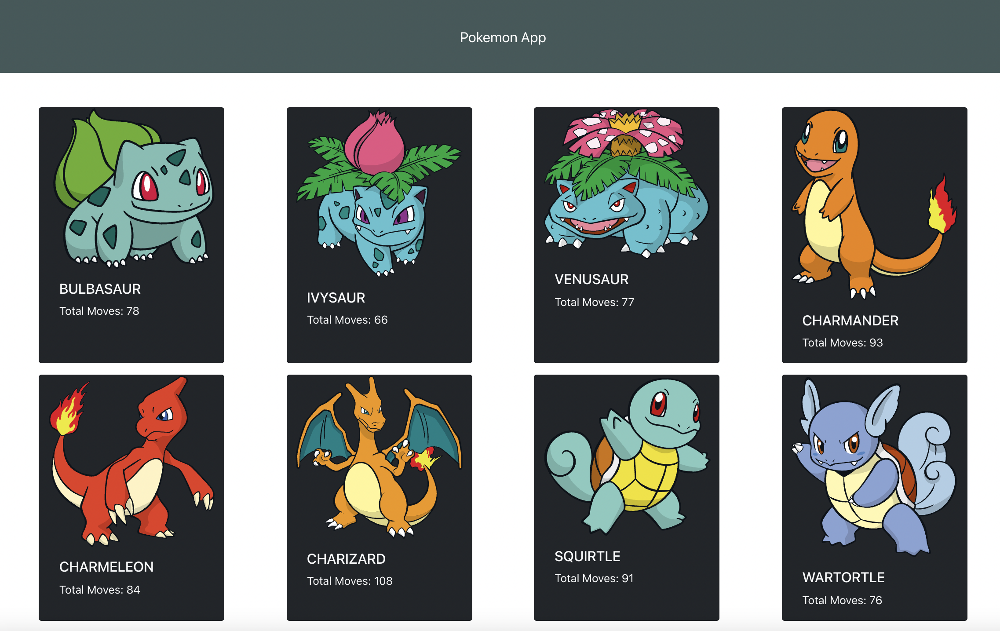

# POKEMAN APP

## Technologies

### build with

- axios: ^0.24.0
- cors: ^2.8
- react: ^17.0
- react-bootstrap: ^2.1

### API used

[Pokeapi](https://pokeapi.co/)

## Screenshot



## Setup

To build this app from scratch you need to have node and npm installed in your machine and then run following commands

```shell
$ npx create-react-app <project name>
$ cd project directory
$ npm init
$ npm install react-bootstrap
$ npm install axios
$ npm install
```

## index html

include in index.html link for bootstrap

```shell
<link
  rel="stylesheet"
  href="https://cdn.jsdelivr.net/npm/bootstrap@5.1.3/dist/css/bootstrap.min.css"
  integrity="sha384-1BmE4kWBq78iYhFldvKuhfTAU6auU8tT94WrHftjDbrCEXSU1oBoqyl2QvZ6jIW3"
  crossorigin="anonymous"/>
```

## App js

- import your BootStrap components
- use useState hook for changing pokemon data.
- use useEffect hook for fetching api data from pokeapi.

<!-- // function showAvatar(githubUser) {
  //   return new Promise(function(resolve, reject) {
  //     let img = document.createElement('img');
  //     img.src = githubUser.avatar_url;
  //     img.className = "promise-avatar-example";
  //     document.body.append(img);

  //     setTimeout(() => {
  //       img.remove();
  //       resolve(githubUser);
  //     }, 3000);
  //   });
  // }

  // Use them:
  // loadJson('/article/promise-chaining/user.json')
  //   .then(user => loadGithubUser(user.name))
  //   .then(showAvatar)
  //   .then(githubUser => alert(`Finished showing ${githubUser.name}`)); -->
